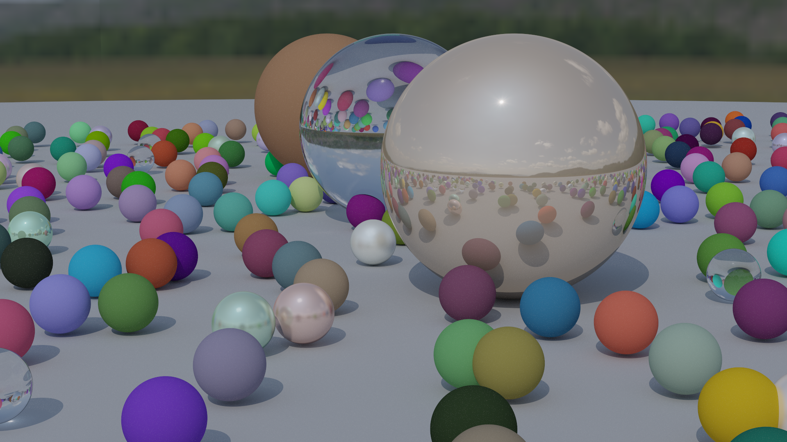
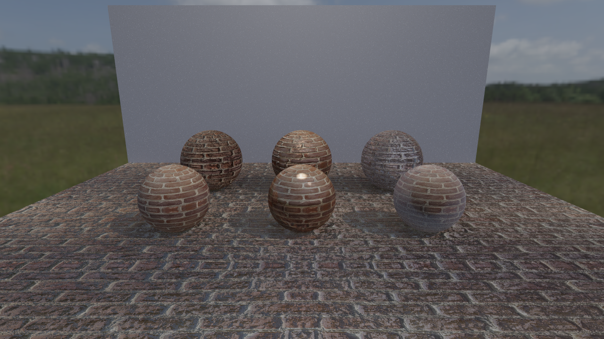
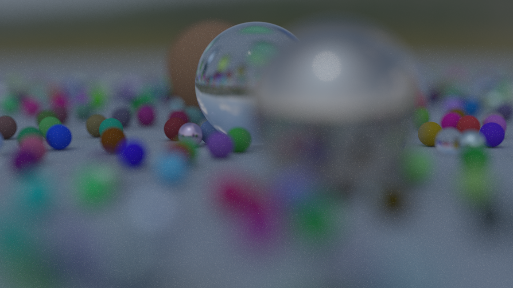

# Physically-Based Path Tracer

A high-performance, physically-based path tracer written in C++ with CUDA GPU acceleration. The renderer supports production-scale triangle meshes, HDR environment lighting, physically-based materials, and progressive rendering — targeting offline image synthesis with accurate global illumination.

The system is architected as two parallel render paths — a multithreaded CPU backend and a CUDA GPU backend — sharing a common scene description, material model, and BVH acceleration structure. Both paths produce equivalent output, enabling validation and flexible deployment across hardware configurations.


*Sponza Atrium — 66k triangles, HDR environment lighting, textured Lambertian and specular materials*


*San Miguel — ~10 million triangles, full global illumination*

---

## Features

### Core Rendering

The renderer implements unbiased Monte Carlo path tracing with recursive light transport. At each surface interaction, the integrator evaluates direct illumination via Next Event Estimation (NEE) and indirect illumination via BSDF importance sampling, combining both estimators through Multiple Importance Sampling (MIS) using the power heuristic. This eliminates variance spikes that arise when either the light or BSDF sampling strategy alone is poorly suited to the local geometry.

Russian roulette termination provides unbiased path length reduction: after a configurable depth threshold, paths are stochastically terminated with probability proportional to throughput magnitude, and surviving paths are reweighted by the inverse survival probability. Combined with a hard throughput clamp, this controls firefly artifacts from degenerate PDF ratios without introducing systematic bias.

Anti-aliasing is achieved through stochastic sub-pixel sampling — each sample jitters the ray origin within the pixel footprint, and the final pixel value is the mean of all samples. Progressive rendering accumulates samples over time, enabling early preview and arbitrarily high sample counts.

### Acceleration and Performance

Scene geometry is organized into a Bounding Volume Hierarchy (BVH) constructed using the Surface Area Heuristic (SAH). The BVH reduces ray-scene intersection from O(n) to expected O(log n), which is essential for scenes with millions of primitives. The GPU path uses an iterative, stack-based BVH traversal with ordered child traversal (near-child-first) to minimize redundant intersection tests.

On the CPU side, rendering is parallelized via a tile-based work-stealing architecture: the image is subdivided into 64x64 pixel tiles, and a pool of worker threads atomically claims tiles from a shared queue. This provides near-linear scaling across cores with minimal synchronization overhead.

The CUDA backend launches render kernels in small batches (typically 4 samples per launch) to avoid triggering the operating system's TDR watchdog on Windows, while still saturating GPU occupancy. A persistent accumulation buffer on device memory allows progressive sample accumulation without repeated host-device transfers. Intermediate results can be downloaded and saved between batches for progressive preview.

The flat GPU scene representation packs all primitives, materials, textures, and BVH nodes into contiguous device memory arrays, eliminating pointer indirection and enabling coalesced memory access patterns. All CPU-side polymorphism (virtual dispatch on `Hittable`, `Material`, `Texture`) is resolved at upload time into tagged unions and integer indices suitable for GPU execution.

### Materials and Lighting

The material system supports five physically-motivated surface types:

**Lambertian diffuse** surfaces scatter incoming light according to a cosine-weighted hemisphere distribution. The scattering PDF is analytically available, enabling proper MIS weighting against light sampling.

**Metal / specular** surfaces reflect rays about the surface normal with an optional fuzz parameter that perturbs the reflected direction, simulating roughened metallic surfaces.

**Dielectric / glass** surfaces implement Snell's law refraction with Schlick's approximation for the Fresnel reflectance term. Total internal reflection is handled correctly. The material is flagged as transmissive so that NEE shadow rays do not incorrectly occlude behind glass.

**Glossy** surfaces blend specular and diffuse components probabilistically. The specular lobe uses GGX-like importance sampling around the reflected direction, with Schlick Fresnel modulation. The diffuse component falls back to standard Lambertian sampling. The scattering PDF accounts for the blend ratio to ensure correct MIS weighting.

**Emissive** surfaces act as area light sources. When hit by a camera or BSDF-sampled ray, their contribution is MIS-weighted against the NEE estimator to prevent double-counting.

The lighting system supports directional lights (treated as delta distributions with no BSDF-side MIS), point lights, and sphere area lights with solid-angle cone sampling. All non-delta light types participate in MIS with the BSDF sampling strategy.

HDR environment maps provide image-based lighting via equirectangular projection. The sky texture is sampled for any ray that escapes the scene, providing realistic ambient illumination from captured real-world environments.


*Random sphere scene — Lambertian, metal, dielectric, and emissive materials under HDR environment lighting*

### Texture and Normal Mapping

The renderer supports texture-mapped albedo and emission via OBJ/MTL material definitions. Textures are loaded as sRGB and linearized at sample time (gamma 2.2 decode on CPU; fast x² approximation on GPU). A mipmap chain is generated on the CPU path for level-of-detail filtering based on ray distance.

Tangent-space normal mapping and grayscale bump mapping are both supported. The TBN frame is computed from UV gradients using Gram-Schmidt orthogonalization, with fallback to an arbitrary tangent when UV derivatives are degenerate. Bump maps use finite-difference gradient estimation to perturb the shading normal. Both techniques preserve the geometric normal for self-intersection offset, preventing shadow acne on mapped surfaces.


*Normal mapping and bump mapping demonstration*

### Scene and Asset Support

Scene geometry is loaded from Wavefront OBJ files with full MTL material support, including diffuse textures (`map_Kd`), emission textures (`map_Ke`), normal maps, and bump maps. The OBJ loader (via tinyobjloader) handles triangulation, per-vertex normals, and texture coordinates. Scenes such as San Miguel (~10 million triangles) and Sponza (~66k triangles) load and render without modification.

A scene registry system allows declarative scene definitions: each scene is a standalone `.cpp` file that populates a `SceneDesc` struct with geometry, camera parameters, lights, and HDR sky path. Registration is automatic via a macro (`REGISTER_SCENE`), and both CPU and CUDA entry points discover scenes from the shared registry.

---

## How It Works

### Rendering Pipeline

1. **Scene Construction** — The selected scene function populates a `SceneDesc` with geometry (as a `HittableList`), camera parameters, explicit lights, and an optional HDR sky path.

2. **BVH Build** — The primitive list is partitioned recursively using the SAH cost model. On the GPU path, the CPU-side BVH tree is flattened into a contiguous array of `GpuBVHNode` structs with integer child indices.

3. **Ray Generation** — For each pixel, rays are generated with stochastic sub-pixel jitter. The camera model supports configurable field of view, aperture (depth of field), and focus distance.

4. **Path Tracing** — Each ray is traced through the BVH. At each hit, the integrator evaluates NEE (shadow ray to each explicit light, MIS-weighted), then samples the BSDF for the next bounce direction. Throughput is accumulated multiplicatively; Russian roulette terminates low-energy paths.

5. **Accumulation** — Sample radiance is summed into a framebuffer. On the CPU, division by sample count happens at write time. On the GPU, a separate normalization kernel divides the accumulation buffer by total samples.

6. **Tone Mapping and Output** — The final linear HDR image is tone-mapped (Reinhard per-channel) and gamma-corrected (sqrt, approximating sRGB) before quantization to 8-bit PNG.

### CPU vs. GPU Architecture

The CPU path uses double-precision arithmetic, virtual dispatch for materials and geometry, and `std::shared_ptr` for memory management. The GPU path mirrors the same integrator logic but uses single-precision floats, tagged enums instead of virtual dispatch, flat arrays instead of pointer trees, and `curandState` for per-pixel RNG. Both paths share the scene description layer and produce visually equivalent output.

---

## Performance

| Scene | Triangles | Resolution | Samples | CPU Time | GPU Time |
|---|---|---|---|---|---|
| Random Spheres | ~500 | 1080x720 | 200 spp | ~minutes | ~seconds |
| Sponza | ~66k | 1920x1080 | 200 spp | ~hours | ~minutes |
| San Miguel | ~10M | 1080x720 | 200 spp | impractical | ~minutes |

*Times are approximate and depend heavily on hardware, max depth, and lighting complexity. GPU timings measured on an RTX 3080 (sm_86).*

The BVH acceleration structure is critical for large scenes. On the Stanford Bunny (~70k triangles), BVH traversal provides roughly two orders of magnitude speedup over brute-force intersection. The CUDA backend adds an additional order of magnitude over multithreaded CPU rendering for equivalent sample counts.

---

## Build Instructions

### Requirements

- CMake 3.18 or later
- C++17-compatible compiler (MSVC, GCC, or Clang)
- CUDA Toolkit (optional, for GPU rendering)
- No external dependencies beyond the standard library (stb_image, stb_image_write, and tinyobjloader are vendored)

### Build

```bash
mkdir build && cd build
cmake .. -DCMAKE_BUILD_TYPE=Release
cmake --build . --config Release
```

To target a specific CUDA architecture (e.g., sm_86 for Ampere):

```bash
cmake .. -DCMAKE_CUDA_ARCHITECTURES=86
```

On Windows with Visual Studio:

```powershell
mkdir build; cd build
cmake .. -G "Visual Studio 17 2022" -A x64 -DCMAKE_CUDA_ARCHITECTURES=86
cmake --build . --config Release
```

If CUDA is not available, only the CPU target (`render`) is built. The CUDA target (`render_cuda`) is conditionally enabled when a CUDA compiler is detected.

---

## Usage

Both executables accept a scene name and an output path as positional arguments:

```bash
# CPU renderer
./render <scene_name> <output_path>

# GPU renderer
./render_cuda <scene_name> <output_path>
```

### Examples

```bash
# Render the default scene (random_spheres) to image.png
./render

# Render Sponza on the GPU
./render_cuda sponza ../../sponza_output.png

# Render San Miguel on the GPU
./render_cuda san_miguel ../../san_miguel_output.png
```

Available scenes are printed at startup. Scene parameters (resolution, sample count, max depth, camera, HDR sky) are configured within each scene definition file.

---

## Controls and Parameters

Rendering parameters are set per-scene in the `SceneDesc` struct:

| Parameter | Default | Description |
|---|---|---|
| `width` | 1080 | Image width in pixels |
| `height` | 720 | Image height in pixels |
| `samples_per_pixel` | 200 | Number of samples per pixel |
| `max_depth` | 60 | Maximum ray bounce depth |
| `vfov` | 60.0 | Vertical field of view (degrees) |
| `aperture` | 0.0 | Lens aperture for depth of field |
| `sky_hdr_path` | (empty) | Path to HDR environment map |
| `sky_intensity` | 1.0 | HDR sky radiance multiplier |


*Effect of field of view adjustment on the random sphere scene*

---

## Project Structure

```
├── core/                   # Vec3, Ray, Camera, Hittable interface
├── objects/                # Sphere, Triangle, Plane, BVH, OBJ loader
├── materials/              # Lambertian, Metal, Dielectric, Glossy, Emissive
├── textures/               # Image textures, HDR textures, solid colors
├── lights/                 # Directional, point, and sphere area lights
├── renderer/
│   ├── renderer.h          # CPU integrator (ray_color, NEE, MIS, tiling)
│   └── cuda/
│       ├── cuda_scene.cuh  # GPU data structures (GpuVec3, GpuMaterial, etc.)
│       ├── cuda_bvh.cuh    # CPU-to-GPU scene flattening and BVH export
│       ├── cuda_renderer.cu    # GPU integrator kernel
│       └── cuda_renderer.cuh   # CUDA render interface
├── scenes/                 # Scene definitions and registry
├── utils/                  # Image writer (PNG output with tonemapping)
├── external/               # Vendored: stb_image, stb_image_write, tinyobjloader
├── assets/                 # Models, textures, HDR environment maps
├── src/
│   ├── main.cpp            # CPU entry point
│   └── main_cuda.cu        # CUDA entry point
└── CMakeLists.txt
```

### Adding a New Scene

Create a new file `scenes/scene_foo.cpp`, define a build function that populates a `SceneDesc`, and register it:

```cpp
#include "scene_registry.h"

static SceneDesc build_foo() {
    SceneDesc desc;
    // ... populate geometry, camera, lights ...
    return desc;
}

REGISTER_SCENE("foo", build_foo);
```

Add the file to `SHARED_SOURCES` in `CMakeLists.txt`. Both CPU and CUDA entry points will discover it automatically.

---

## Technical Depth

This renderer goes well beyond introductory ray tracing projects in several dimensions:

**GPU acceleration with architectural parity.** The CUDA backend is not a trivial port — it reimplements the full integrator (NEE, MIS, Russian roulette, normal mapping, BVH traversal) in a GPU-native form with flat data structures, iterative traversal, and per-pixel RNG state. The CPU and GPU paths share a common scene description but diverge at the execution model to exploit hardware characteristics of each target.

**Production-scale scene handling.** Rendering San Miguel (10M triangles) requires a memory-efficient flat scene representation, a robust SAH-based BVH, and careful numerical handling. The renderer handles this without simplification or scene reduction.

**Correct light transport.** The integrator implements full MIS between NEE and BSDF sampling with proper PDF accounting for delta lights, area lights, and emissive geometry. Specular paths are flagged to bypass MIS entirely (pdf = -1 sentinel), preventing incorrect weighting on mirror or glass bounces. Emissive hits from BSDF-sampled rays are weighted against the NEE estimator to eliminate double-counting.

**Numerical robustness.** Self-intersection is mitigated by offsetting shadow and secondary ray origins along the geometric normal (not the shading normal, which may be perturbed by normal mapping). NaN and infinity samples are discarded before accumulation. Throughput is hard-clamped to prevent runaway energy from degenerate sampling configurations.

**System architecture.** The scene registry, modular material system, and shared `SceneDesc` layer allow new scenes, materials, and light types to be added without modifying the render loop or GPU kernel. The build system conditionally enables CUDA when available, maintaining a functional CPU-only fallback.

---

## Future Improvements

- Importance-sampled HDR environment map (CDF-based light sampling)
- Bidirectional path tracing or Metropolis light transport
- Denoising integration (Intel Open Image Denoise or OptiX AI denoiser)
- Disney principled BSDF
- Volumetric scattering and participating media
- Motion blur and animated geometry
- Spectral rendering
- OptiX or hardware RT core acceleration
- Interactive preview with progressive refinement

---

## References

Shirley, P. (2020). *Ray Tracing in One Weekend*. https://raytracing.github.io/

Pharr, M., Jakob, W., & Humphreys, G. (2016). *Physically Based Rendering: From Theory to Implementation* (3rd ed.). Morgan Kaufmann.

Veach, E. (1997). *Robust Monte Carlo Methods for Light Transport Simulation*. PhD thesis, Stanford University.

---

## Asset Credits

Models downloaded from Morgan McGuire's Computer Graphics Archive:
https://casual-effects.com/data

---

## License

This project is provided for educational and portfolio purposes.